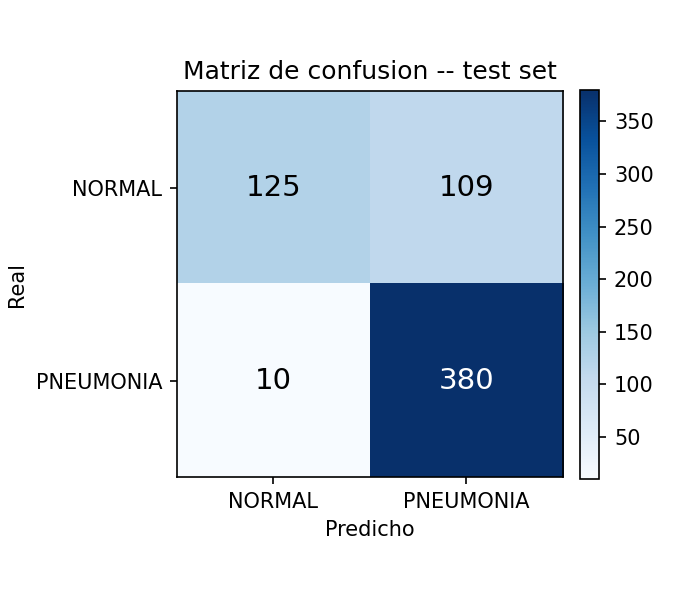
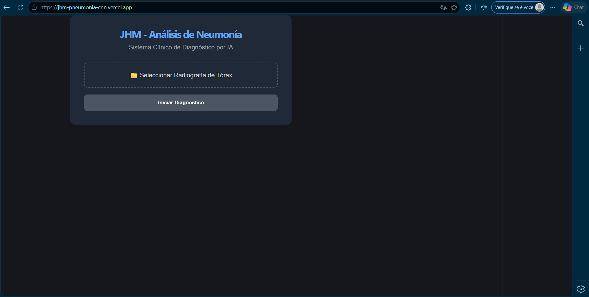
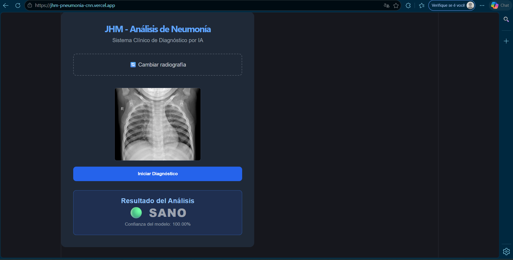
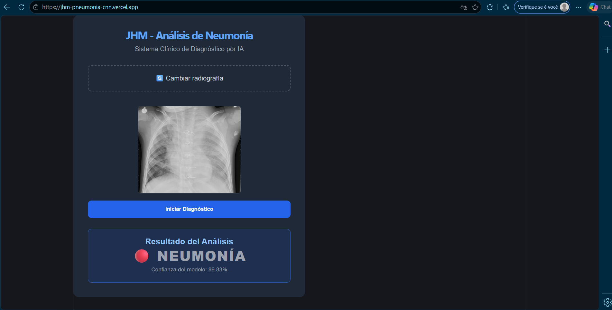

🇧🇷 Português (atual) · [🇪🇸 Español](README.es.md) · [🇬🇧 English](README.en.md)

# JHM — Plataforma de Detecção de Pneumonia (Deep Learning + MLOps)


Sistema end-to-end de detecção automática de pneumonia em radiografias de
tórax, usando uma Rede Neural Convolucional (CNN) em PyTorch. Cobre todo o
ciclo de um projeto de MLOps aplicado a um caso de uso clínico: treinamento
e avaliação rigorosa do modelo, API de inferência em tempo real, auditoria
e versionamento de modelos em produção, observabilidade real (traces e
métricas), CI/CD completo com scans de segurança e versionamento semântico,
e deploy automático em nuvem.

**Demo ao vivo:**
- Frontend: **[jhm-pneumonia-cnn.vercel.app](https://jhm-pneumonia-cnn.vercel.app)** — envie uma radiografia e receba o diagnóstico em segundos.
- API: **[jhm-pneumonia-api.onrender.com](https://jhm-pneumonia-api.onrender.com)** ([`/docs`](https://jhm-pneumonia-api.onrender.com/docs) para a documentação interativa OpenAPI).

> Uso educacional/portfólio. **Não é um dispositivo médico** e não deve ser
> usado para diagnóstico clínico real — ver [Limitações](#limitações-e-uso-responsável).

## Sumário

- [Arquitetura](#arquitetura)
- [Dataset](#dataset)
- [Modelo](#modelo)
- [Resultados](#resultados)
- [Otimização de hiperparâmetros — o que funcionou e o que não funcionou](#otimização-de-hiperparâmetros--o-que-funcionou-e-o-que-não-funcionou)
- [API](#api)
- [MLOps: auditoria, versionamento e observabilidade](#mlops-auditoria-versionamento-e-observabilidade)
- [CI/CD](#cicd)
- [Como rodar localmente](#como-rodar-localmente)
- [Estrutura do repositório](#estrutura-do-repositório)
- [Frontend](#frontend)
- [Limitações e uso responsável](#limitações-e-uso-responsável)
- [Próximos passos](#próximos-passos)
- [Licença e autoria](#licença-e-autoria)

## Arquitetura

```
┌─────────────────┐      HTTPS       ┌──────────────────────┐      inferência      ┌─────────────┐
│  React (Vite)    │ ───────────────▶│   FastAPI (Render)    │ ───────────────────▶│ PneumoniaCNN │
│  Vercel          │◀─────────────── │   /predict /health     │◀──────────────────── │  (PyTorch)   │
└─────────────────┘   JSON result    │   /model/info /metrics │     NORMAL/PNEUMONIA └─────────────┘
                                      └──────────┬─────────────┘
                                                  │ SQLAlchemy
                                                  ▼
                                      ┌──────────────────────┐
                                      │  PostgreSQL           │
                                      │  auditorias_diagnostico│
                                      │  model_registry        │
                                      └──────────────────────┘
                                                  │
                                                  │ OTLP (traces + métricas)
                                                  ▼
                                      ┌──────────────────────┐
                                      │  Grafana Cloud        │
                                      └──────────────────────┘
```

Backend e frontend vivem no mesmo monorepo (`jhm-pneumonia-cnn/` e
`jhm-pneumonia-frontend/`) mas se deployam de forma independente: o backend
como container Docker no Render, o frontend como site estático no Vercel,
cada um com seu próprio pipeline de CI/CD.

## Dataset

- **Fonte:** [Chest X-Ray Images (Pneumonia)](https://www.kaggle.com/datasets/paultimothymooney/chest-xray-pneumonia) — Kaggle, imagens de radiografias de tórax pediátricas do Guangzhou Women and Children's Medical Center.
- **Classes:** `NORMAL` / `PNEUMONIA`.
- **Tamanho:** 5.218 imagens de treino (1.342 NORMAL / 3.876 PNEUMONIA), 624 de teste (234 / 390), 16 de validação oficial (muito pequena para ser usada de forma confiável — ver seção de otimização abaixo).
- **Nota conhecida sobre este dataset:** train/ e test/ vêm de lotes/fontes com características de imagem um pouco diferentes (um *distribution shift* documentado por outros usuários do dataset). Isso teve impacto direto na metodologia de otimização deste projeto — ver mais abaixo.

## Modelo

`PneumoniaCNN` ([`src/model.py`](jhm-pneumonia-cnn/src/model.py)): 3 blocos convolucionais
(16→32→64 canais, com BatchNorm + ReLU + MaxPool) seguidos de duas camadas
densas (128 → 2) com dropout 0.5. Entrada: radiografia em escala de cinza,
128×128. Arquitetura simples e rápida de propósito — o objetivo do projeto
é a plataforma MLOps completa ao redor do modelo, não bater estado da arte
em classificação de imagens médicas.

## Resultados

Avaliado em [`src/evaluate.py`](jhm-pneumonia-cnn/src/evaluate.py) sobre as
624 imagens de `data/test/`, **nunca usadas em nenhuma etapa de treinamento
ou seleção de hiperparâmetros**:

| Métrica | NORMAL | PNEUMONIA |
|---|---|---|
| Precision | 92,6% | 77,7% |
| **Recall** | 53,4% | **97,4%** |
| F1 | 67,8% | 86,5% |

**Accuracy geral: 80,9%** (624 amostras). A métrica primária escolhida é o
**recall de PNEUMONIA (97,4%)**: em triagem de pneumonia, um falso negativo
(paciente doente classificado como saudável) é o erro clinicamente mais
caro — muito mais que um falso positivo, que só implica uma revisão manual
a mais. O modelo erra para o lado seguro: só 10 dos 390 casos reais de
pneumonia no test set passam despercebidos.



## Otimização de hiperparâmetros — o que funcionou e o que não funcionou

Esta seção existe porque um resultado negativo, bem investigado, também é
um resultado real — e esconder isso seria menos honesto do que documentá-lo.

**Primeira tentativa:** separar 15% de `data/train/` como validação para
comparar 5 configurações (learning rate, class weights, data augmentation).
Resultado: a melhor configuração atingiu **98,2% de accuracy em
validação** — ótimo demais para ser verdade. Ao medir essa mesma
configuração contra `data/test/` real, a accuracy foi de **71,6%**, pior
que a configuração original (80,9%), com o recall de NORMAL caindo de 53%
para 25%. A causa: uma validação recortada de `train/` não representa a
distribuição de `test/` *neste dataset especificamente* (ver nota na seção
Dataset) — o modelo estava overfitando em características específicas do
lote de treino.

**Segunda tentativa (correta):** a validação passou a ser uma fatia do
próprio `test/` (40%, "tuning_val"), deixando os outros 60%
("holdout_final") completamente isolados até a decisão final — nunca
vistos durante o treinamento nem durante a escolha de configuração. Compara-se
o modelo candidato contra o modelo em produção **apenas** em `holdout_final`
([`src/compare_holdout.py`](jhm-pneumonia-cnn/src/compare_holdout.py)):

| Modelo | Accuracy | F1 macro | Recall PNEUMONIA | Recall NORMAL |
|---|---|---|---|---|
| **Produção (original)** | **78,7%** | **0,743** | 96,2% | 49,7% |
| Candidato (augmentation, 10 épocas) | 72,0% | 0,615 | 99,6% | 26,2% |

**Conclusão: nenhuma configuração testada superou o modelo original.**
A configuração de produção permanece sem alterações. O valor real deste
processo não foi "melhorar um número" — foi identificar uma armadilha
metodológica real (validação não representativa), corrigi-la, e confirmar
com rigor que a escolha original já era sólida para esta arquitetura.
Detalhes completos em [`outputs/hyperparameter_search.csv`](jhm-pneumonia-cnn/outputs/hyperparameter_search.csv),
[`outputs/best_config.json`](jhm-pneumonia-cnn/outputs/best_config.json) e
[`outputs/holdout_comparison.json`](jhm-pneumonia-cnn/outputs/holdout_comparison.json).

## API

FastAPI ([`api/main.py`](jhm-pneumonia-cnn/api/main.py)), documentação
interativa em [`/docs`](https://jhm-pneumonia-api.onrender.com/docs):

| Endpoint | Método | Descrição |
|---|---|---|
| `/` | GET | Status básico e versão do modelo ativo |
| `/health` | GET | Health check detalhado (modelo carregado, conexão com o banco) |
| `/model/info` | GET | Metadados do modelo ativo (MLOps — Model Registry) |
| `/predict` | POST | Recebe uma imagem, retorna `prediction`, `confidence`, `latency_ms` — limitado a 10 requisições/minuto por IP |
| `/metrics` | GET | Métricas Prometheus (requests, latência) |

## MLOps: auditoria, versionamento e observabilidade

- **Auditoria** ([`api/models.py`](jhm-pneumonia-cnn/api/models.py) →
  `AuditoriaDiagnostico`): cada predição feita em produção fica registrada
  em Postgres — imagem, resultado, confiança, latência e versão do modelo
  usado. Rastreabilidade completa do que o sistema respondeu, quando e com
  qual modelo.
- **Model Registry** (`ModelRegistry`): tabela que versiona os modelos
  implantados (versão, accuracy, data de deploy, descrição) — a base para
  saber qual modelo está ativo e comparar versões ao longo do tempo.
- **Observabilidade real**: OpenTelemetry instrumenta cada requisição
  (`/predict`) com traces distribuídos, e exporta traces + métricas via
  OTLP para o **Grafana Cloud** quando `OTEL_EXPORTER_OTLP_ENDPOINT` está
  configurado no ambiente. Prometheus (`prometheus-fastapi-instrumentator`)
  expõe `/metrics` para scraping adicional. Rate limiting (10 req/min por
  IP) protege o endpoint de inferência contra abuso.

## CI/CD

4 workflows no GitHub Actions ([`.github/workflows/`](.github/workflows/)):

- **`ci-pipeline.yml`** — a cada push/PR em `main`/`dev`: lint + SAST
  (`bandit`) + scan de dependências vulneráveis (`safety`) + suite de testes
  com cobertura (`pytest --cov`, reportada no Codecov).
- **`deploy-staging.yml`** — push em `dev` dispara deploy automático no
  ambiente de staging do Render.
- **`deploy-prod.yml`** — push em `main` dispara deploy automático em
  produção no Render.
- **`release.yml`** — versionamento semântico automático
  ([release-please](https://github.com/googleapis/release-please-action)),
  gera o CHANGELOG a partir das mensagens de commit (Conventional Commits).

Dependabot ([`.github/dependabot.yml`](.github/dependabot.yml)) mantém
dependências Python, npm e as próprias GitHub Actions atualizadas
semanalmente.

## Como rodar localmente

Backend (requer Docker):

```bash
cd jhm-pneumonia-cnn
cp .env.example .env   # se não existir, ver docker-compose.yml para as variáveis
docker compose up
# API disponível em http://localhost:8000/docs
```

Frontend:

```bash
cd jhm-pneumonia-frontend
npm install
npm run dev
# abre em http://localhost:5173
```

Treinar/reavaliar o modelo (requer as imagens do dataset em `data/`, GPU opcional):

```bash
cd jhm-pneumonia-cnn
pip install torch torchvision --index-url https://download.pytorch.org/whl/cpu
pip install -r requirements.txt -r requirements-train.txt
python -m src.train      # treina do zero com a receita original
python -m src.evaluate   # avalia contra data/test/, gera reports/figures/confusion_matrix.png
python -m src.tune       # busca de hiperparâmetros (ver metodologia acima)
```

## Estrutura do repositório

```
jhm-pneumonia-monorepo/
├── jhm-pneumonia-cnn/            # backend
│   ├── api/                      # FastAPI: main.py, models.py, database.py
│   ├── src/                      # model.py, train.py, evaluate.py, tune.py, compare_holdout.py
│   ├── tests/                    # unit/ + integration/
│   ├── outputs/                  # evaluation_report.json, hyperparameter_search.csv, ...
│   ├── data/                     # dataset (não versionado, ver .gitignore)
│   └── Dockerfile
├── jhm-pneumonia-frontend/       # React + Vite
├── .github/workflows/            # CI, deploy staging/prod, release
├── render.yaml                   # config de deploy do backend
└── LICENSE
```

## Frontend

React 19 + Vite, deploy no Vercel. Upload de radiografia → preview → envio
para `/predict` → exibição do resultado com nível de confiança.

| Tela inicial | Resultado: sano | Resultado: pneumonia |
|---|---|---|
|  |  |  |

## Limitações e uso responsável

- **Não é um dispositivo médico** e não passou por nenhum processo de
  validação clínica ou regulatória. É um projeto educacional/de portfólio
  que demonstra uma plataforma de ML em produção de ponta a ponta.
- O modelo tem recall de NORMAL relativamente baixo (53%) — tende a
  super-prever PNEUMONIA. Essa é uma escolha deliberada (ver Resultados),
  mas significa que, num cenário real, resultados NORMAL precisariam de
  confirmação adicional antes de serem tratados como definitivos.
- O dataset tem um viés de distribuição conhecido entre train/test (ver
  Dataset) — generalização para radiografias de outras fontes/hospitais
  não está garantida.

## Próximos passos

- Enriquecer o dataset com imagens de múltiplas fontes para reduzir o
  distribution shift documentado acima.
- Explorar arquiteturas maiores/pré-treinadas (transfer learning com
  ResNet/DenseNet) como comparação contra a CNN simples atual.
- Dashboards no Grafana Cloud sobre as métricas/traces já exportados.

## Licença e autoria

Distribuído sob licença [MIT](LICENSE).

**Autor:** Harre Ayma Aranda — único autor deste repositório.
